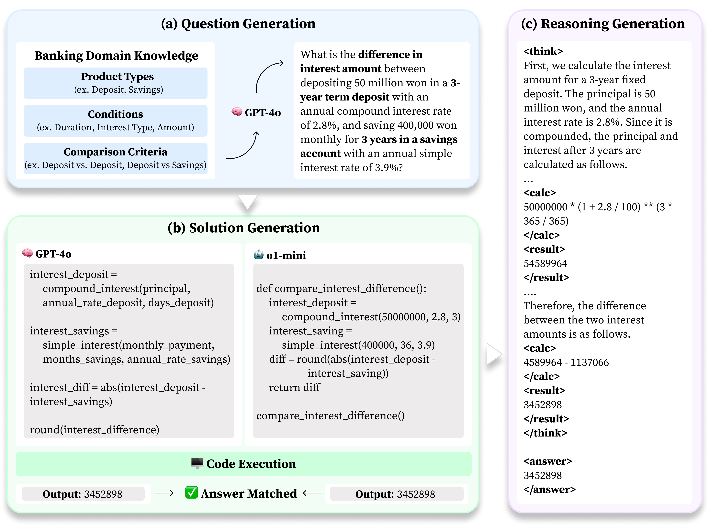

# BankMathBench

Official dataset repository for our LREC 2026 paper:
**[BankMathBench: A Benchmark for Numerical Reasoning in Banking Scenarios](https://arxiv.org/pdf/2602.17072)**  


## Overview

BankMathBench is a benchmark for evaluating numerical reasoning in realistic banking scenarios.  
This repository provides train/test datasets across three difficulty levels:

- `1_basic`
- `2_intermediate`
- `3_advanced`

Each level includes English (`eng`) and Korean (`kor`) versions.

## Main Framework




## Sample Counts

All counts below are the number of data rows (header excluded).

| Level | Split | English | Korean | Total |
|---|---:|---:|---:|---:|
| Basic | Train | 2,236 | 2,236 | 4,472 |
| Basic | Test | 559 | 559 | 1,118 |
| Intermediate | Train | 1,702 | 1,708 | 3,410 |
| Intermediate | Test | 423 | 426 | 849 |
| Advanced | Train | 1,596 | 1,596 | 3,192 |
| Advanced | Test | 399 | 399 | 798 |
| **Total** |  | **6,915** | **6,924** | **13,839** |


## Data Format

CSV files contain banking scenario questions and numeric answers.

- Common columns: `index`, `question`, `reasoning`, `answer`

## Calculation Assumptions

Unless explicitly stated otherwise in a question:

- Installment savings (`적금`) uses formulas based on deposits made at the **beginning** of each period and maturity at the **end** of each period.
- Interest is calculated on a **pre-tax** basis.

## Citation

If you use this dataset, please cite:

```bibtex
@article{bankmathbench2026,
  title={BankMathBench: A Benchmark for Numerical Reasoning in Banking Scenarios},
  journal={arXiv preprint arXiv:2602.17072},
  year={2026}
}
```

## Copyright

본 데이터셋 및 저장소 내 자료의 저작권은 **주식회사 카카오뱅크**에 있습니다.  
Copyright (c) KakaoBank Corp. All rights reserved.
